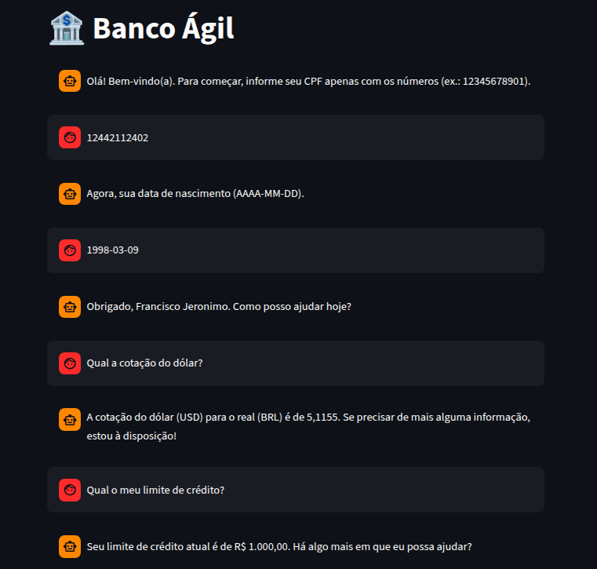
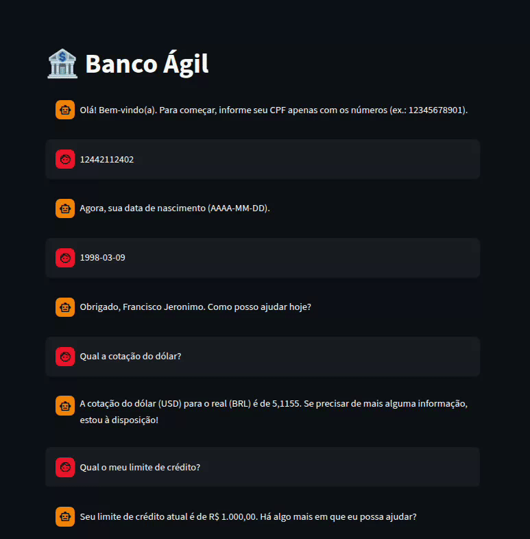

# Agente Bancário Inteligente (Banco Ágil)

O Agente bancário é um sistema de atendimento bancário construído sobre uma arquitetura multi-agente, onde um agente principal coordena especialistas de domínio (crédito, câmbio, entrevista financeira) após autenticação de um Agent de Triagem.

## Arquitetura

### Visão geral

```
Cliente → triage_agent (autenticação) → main_agent (orquestrador)
                                              ├── call_credit_agent            → credit_agent
                                              ├── call_credit_interview_agent  → credit_interview_agent
                                              └── call_currency_agent          → currency_agent
```

**Divisão das responsabilidades:**
Arquitetura em duas camadas: um agente de triagem (`triage_agent`) atua como porta de entrada obrigatória, autenticando o cliente (CPF + data de nascimento, até 3 tentativas) de forma 100% determinística em código Python, o LLM apenas coleta os dados, nunca decide a autenticação. Após autenticado, o cliente é encaminhado ao `main_agent`, que direciona a conversa para especialistas (`credit_agent`, `currency_agent`, `credit_interview_agent`) construídos com create_agent e chamados como ferramentas, seguindo o padrão de subagents do langchain.

**Estado compartilhado (`state.py`):**

Definidos dois schemas: `TriageState`, que controla as tentativas de autenticação e os dados do cliente já autenticado; e `BankState`, usado pelo `main_agent` e pelos especialistas para manter CPF, nome, limite e score disponíveis durante toda a conversa, sem precisar solicitá-los novamente ao cliente.

**Memória por subagente:**

Como subagents são stateless por padrão (cada chamada é um `.invoke()` isolado), agentes que precisam de conversas multi-turno com o cliente , `triage_agent` (coleta de CPF e data de nascimento), `credit_interview_agent` (5 perguntas sequenciais) e `credit_agent` (pergunta de acompanhamento sobre o limite desejado), recebem um `checkpointer` próprio com `thread_id` especificos, garantindo que lembrem em qual etapa da conversa estão a cada nova resposta.

## Stack principal

- **Python 3.12**
- **Streamlit**: Interface de chat para testes
- **LangChain**: Construção dos agentes
- **LangGraph**: Controle de estado e execução por trás de cada agente

**Por que essa stack:**

A ideia do projeto era simular um atendimento bancário real, onde pedidos diferentes (consulta de limite, câmbio, entrevista de crédito) são resolvidos por especialistas diferentes, mas para o cliente tudo parece uma única conversa. LangChain e LangGraph já resolvem boa parte desse problema: mantêm o contexto entre as mensagens, permitem que os agentes atualizem esse contexto conforme a conversa avança e cuidam do fluxo entre eles, sem precisar montar esse controle na mão.

Já o Streamlit entrou pela praticidade: permite montar uma interface de chat funcional rapidamente, deixando o foco no comportamento dos agentes, e não na parte visual.

## Estrutura do projeto

```
├── agents
│   ├── credit_agent.py
│   ├── credit_interview_agent.py
│   ├── currency_agent.py
│   └── triage_agent.py
├── config
│   └── config_logging.py
├── data
│   ├── clientes.csv
│   ├── score_limite.csv
│   └── solicitacoes_aumento_limite.csv
├── docs
│   ├── fluxo-00-cotacao-consulta-limite.png
│   ├── fluxo-01-aprovacao-sem-entrevista.gif
│   ├── fluxo-02-rejeitado-após-entrevista.gif
│   └── fluxo-03-entrevista-aprovado-novo-limite.gif
├── logs
│   └── app.log
├── schemas
│   ├── customer.py
│   └── errors.py
├── utils
│   └── utils.py
├── interface.py
├── main_agent.py
├── model.py
├── README.md
├── requirements.txt
└── state.py                      
```


## Desafios enfrentados e como foram resolvidos

**Instabilidade e limites no tier gratuito**: O uso de modelos gratuitos trouxe dois problemas: inconsistência de qualidade/latência por variação automática de modelo a cada chamada, e cotas diárias muito baixas por projeto, o que inviabilizava testes iterativos com múltiplos agentes. Resolvido fixando o modelo e migrando para um provedor com cota mais generosa.

**Prompt "narrado"**: Agentes descrevia ações em vez de executá-las, tive que reestruturar o prompt de cada agent definindo regras para evitar o ocorrido.

**Handoff quebrando**: Troquei o pattern `langgraph_supervisor` descontinuado pelo padrão de subagents com `create_agent`.

**Contador de tentativas travado**: Valor inicial era reenviado em toda chamada, sobrescrevendo o checkpoint; corrigido enviando os defaults só na primeira mensagem via session_state.


## Funcionalidades implementadas

- Autenticação por CPF + data de nascimento, com limite de 3 tentativas.
- Consulta de limite de crédito disponível.
- Solicitação de aumento de limite, com avaliação automática baseada em score.
- Entrevista financeira conversacional (5 perguntas sequenciais) para recalcular o score de crédito quando o limite solicitado excede o permitido pelo score atual.
- Consulta de cotação de câmbio em tempo real (via API pública de câmbio) e histórica.
- Roteamento inteligente entre especialistas via agente principal, mantendo contexto da conversa entre diferentes assuntos.
- Persistência de estado por sessão/thread via checkpointer do LangGraph.
- Logging estruturado, com saída simultânea em terminal e arquivo (`logs/app.log`).


## Tutorial de execução e testes

### Pré-requisitos

- Python 3.12+
- Uma chave de API da OPEN AI ([https://platform.openai.com/settings/organization/api-keys](https://platform.openai.com/settings/organization/api-keys))

### Instalação

```bash
git clone https://github.com/jeronimofjr/agente-bancario
cd agente-bancario

python3 -m venv venv
source venv/bin/activate  # Windows: venv\Scripts\activate

pip3 install -r requirements.txt
```

### Configuração


Crie um arquivo `.env` na raiz do projeto. Você pode copiar o arquivo `.env.example` e renomeá-lo para `.env`:

```bash
cp .env.example .env
```

Em seguida, preencha (ou mantenha) os valores abaixo:

```dotenv
OPENAI_API_KEY=sua_chave_aqui
OPENAI_MODEL=gpt-4o-mini
FRANKFURTER_API_BASE=https://api.frankfurter.dev/v1
```

Garanta que `data/clientes.csv` está populado com pelo menos um cliente de teste (colunas: `cpf`, `data_nascimento`, `nome`, `limite_atual`, `score`).

Exemplo:

```csv
cpf,data_nascimento,nome,limite_atual,score
12442112402,1998-03-09,francisco jeronimo,1000,650
12955347321,2000-11-19,gilberto silva,5000,800
```

### Executando a interface

```bash
streamlit run interface.py
```

A aplicação abre no navegador. Para testar o fluxo completo:

1. Informe o CPF de um cliente cadastrado em `clientes.csv`.
2. Informe a data de nascimento correspondente (formato `AAAA-MM-DD`).
3. Depois de autenticado, teste as três frentes:
   - "Qual a cotação do dólar hoje?"
   - "Qual meu limite de crédito?"
   - "Quero aumentar meu limite de crédito para X (valor)" (valores altos disparam a entrevista de crédito automaticamente, se o score não suportar)

### Exemplos de uso
 
Abaixo, quatro fluxos reais do sistema em funcionamento, cobrindo os principais caminhos da conversa.
 
 **1. Consulta de cotação e de limite de crédito**
 

 

 
**2. Aumento de limite aprovado sem necessidade de entrevista**
 

 
**3. Pedido rejeitado mesmo após a entrevista de crédito**
 

 
**4. Aumento aprovado após a entrevista de crédito**
 


   

